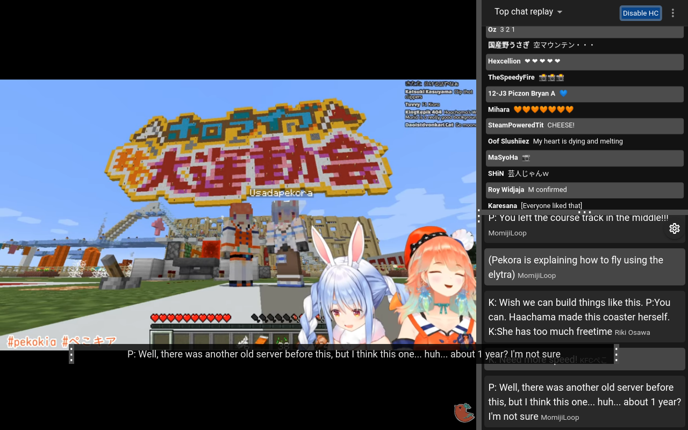

# LiveTL - Translation Filter for Streams

[](https://github.com/LiveTL/LiveTL/actions/workflows/tests.yaml)
[](https://github.com/LiveTL/LiveTL/actions/workflows/tests-e2e.yml)
[](https://www.gnu.org/licenses/agpl-3.0)
[](https://github.com/standard/semistandard)
[](https://github.com/LiveTL/LiveTL/contributors)
[](https://github.com/LiveTL/LiveTL/issues)

[](https://github.com/LiveTL/LiveTL/commits/)
[](https://discord.gg/uJrV3tmthg)

### [Download LiveTL](https://livetl.app/)



## Feedback and Contributing

We have a Discord server for those who would like to give feedback or discuss new
features! [Here is the invite](https://discord.gg/uJrV3tmthg).

If you are interested in helping us solve any issues and/or add features, please let us know in the Discord server and
submit a Pull Request!

## Development

### ⚠️ WARNING ⚠️

Due to unreliable Manifest v3 feature support in Firefox, we maintain both MV2 and MV3 versions of LiveTL in parallel. The MV2 variant sits in the `develop` branch, while the MV3 variant sits on the `mv3-fr` branch. When contributing, please ensure that you check out to the `develop` branch to implement the features in MV2 first. Once the feature is stable, please open a separate PR to the `mv3-fr` branch to port the feature to MV3.

### Setup

> Note: The repo expects a Linux or Unix-like environment. If you are on Windows, use WSL.

> ℹ LiveTL uses submodules. Make sure to clone the repo with the `--recursive` flag!
>
> ℹ When pulling, you should also use `git pull --recurse`.

```bash
yarn # use yarn, not npm
```

### Commands

```bash
yarn start # devServer
yarn build:production # production
yarn package # package extension zips
yarn build:android # android
yarn test # jest
yarn test:watch # autotest
yarn format # lint
yarn e2e # run e2e tests
```

Load the `build` directory in Chrome developer mode.

### Hot Reload

Enable `chrome://flags/#allow-insecure-localhost` to use hot module and UI component reloading.

## Developers

LiveTL is developed by [these fine people](https://github.com/LiveTL/LiveTL/graphs/contributors)!
