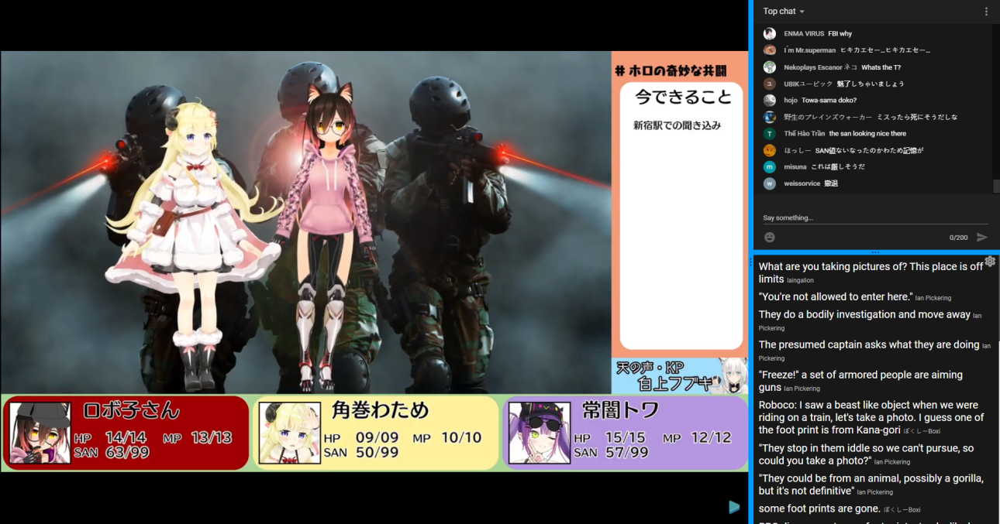

# LiveTL - Live Translations for Streams


[](https://discord.gg/uJrV3tmthg)

Get live translations for YouTube streams, crowdsourced from multilingual viewers!

[Download for Free from the Chrome Web Store](https://chrome.google.com/webstore/detail/livetl-live-translations/moicohcfhhbmmngneghfjfjpdobmmnlg)

[Download for Free from the Firefox Add-on Store](https://addons.mozilla.org/en-US/firefox/addon/livetl/)



## Feedback and Contributing

We have a Discord server for those who would like to give feedback or discuss new features! [Here is the invite](https://discord.gg/uJrV3tmthg).

## Features

* [x] Filter translations for your language (messages tagged with en, es, etc.)
* [x] Select your favorite translators
* [x] Ban spammers polluting translations
* [x] Freely resizable chat, translation panel, and stream
* [x] Support for HoloTools
* [x] Firefox Extension
* [ ] Saved preferences across viewing sessions
* [ ] Verified translators
* [ ] Automatic language tagging for translators
* [ ] Archived VOD Support

## Issues

* [x] Extension and page version mismatch (local file serving to solve?)
* [x] Detect if extension is installed, if not redirect to install page
* [x] Broken in incognito
* [ ] No automated testing

If you are interested in helping us solve these issues and/or add features, please let us know in the Discord server and submit a Pull Request!

## Usage

To build from scratch, execute the following commands in a bash terminal. The resulting extension zip file will be in dist/. The unpacked extension will be in build/

```bash
git clone https://github.com/KentoNishi/LiveTL.git
cd LiveTL/
make
```

## Developers

LiveTL was developed by [Kento Nishi](https://github.com/KentoNishi) and [Ronak Badhe](https://github.com/r2dev2bb8/).
