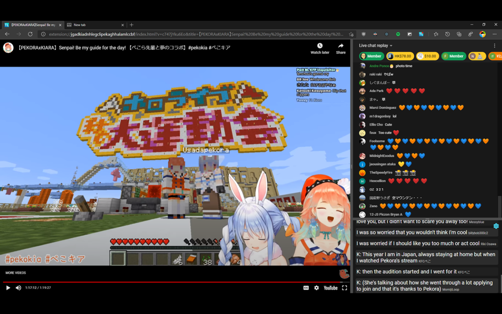

# LiveTL - Live Translations for Streams


[](https://www.gnu.org/licenses/agpl-3.0)
[](https://github.com/standard/semistandard)
[](https://github.com/KentoNishi/LiveTL/contributors)
[](https://github.com/KentoNishi/LiveTL/issues)


[](https://github.com/KentoNishi/LiveTL/commits/)
[](https://discord.gg/uJrV3tmthg)

Get live translations for YouTube streams, crowdsourced from multilingual viewers!

### [Download LiveTL for your Browser](https://kentonishi.github.io/LiveTL/)

or...

[Download for Free from the Chrome Web Store](https://chrome.google.com/webstore/detail/livetl-live-translations/moicohcfhhbmmngneghfjfjpdobmmnlg)

[Download for Free from the Firefox Add-on Store](https://addons.mozilla.org/en-US/firefox/addon/livetl/)

[Download for Safari (currently in beta and not signed by Apple)](https://github.com/KentoNishi/LiveTL/releases/latest/)



## FAQ
[Find some answers to common questions in our FAQ!](https://kentonishi.github.io/LiveTL/about/#frequently-asked-questions)

## Feedback and Contributing

We have a Discord server for those who would like to give feedback or discuss new
features! [Here is the invite](https://discord.gg/uJrV3tmthg).

## Features

* [x] Filter translations for your language (messages tagged with en, es, etc.)
* [x] Select your favorite translators
* [x] Ban spammers polluting translations
* [x] Freely resizable chat, translation panel, and stream
* [x] Support for HoloTools
* [x] Firefox Extension

## Progress
Development progress is managed in the [repo's project page](https://github.com/KentoNishi/LiveTL/projects/1).

If you are interested in helping us solve any issues and/or add features, please let us know in the Discord server and
submit a Pull Request!

## Usage

To build from scratch, execute the following commands in a bash terminal. The resulting extension zip file will be in
dist/. The unpacked extension will be in build/

```bash
git clone https://github.com/KentoNishi/LiveTL.git
cd LiveTL/
make
```

## Developers

LiveTL was developed by [Kento Nishi](https://github.com/KentoNishi) and [Ronak Badhe](https://github.com/r2dev2bb8/).
