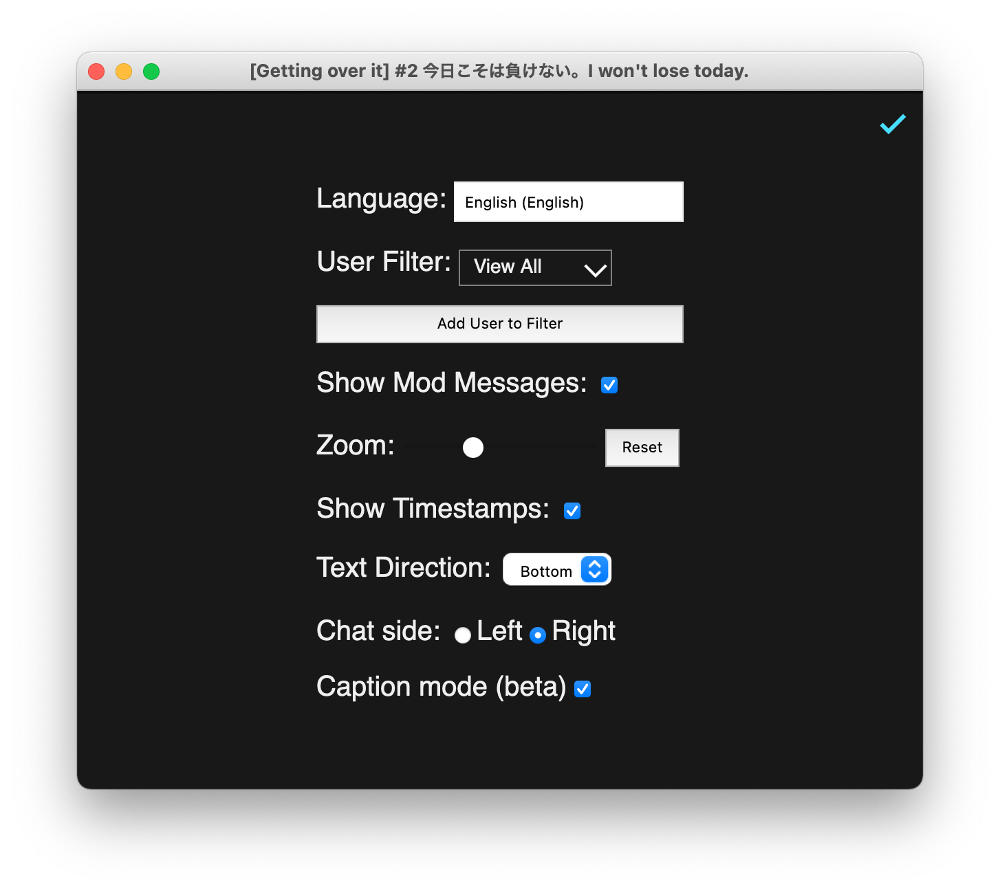

# Getting Started with LiveTL

You must have the [LiveTL extension](https://chrome.google.com/webstore/detail/livetl/moicohcfhhbmmngneghfjfjpdobmmnlg) installed to use LiveTL features.

To get started, visit your favorite streamer on YouTube. The chat should have some new buttons for launching LiveTL!

## Other Info
Feel free to give us feedback or suggestions through the LiveTL Discord server! [Here is the invite](https://discord.gg/uJrV3tmthg).

Our code is completely open source on GitHub. We would appreciate if you could drop a star! [Here is our repository](https://github.com/KentoNishi/LiveTL).

## Screenshots

### Open Stream in LiveTL

### Pop Out LiveTL Chat

### Options

### Translator Selection

### Hide Message / Ban Translator

