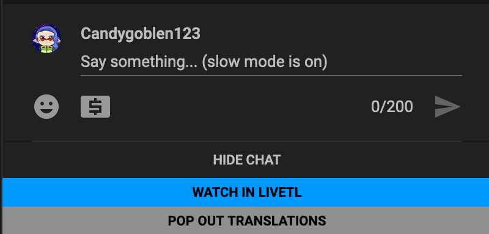
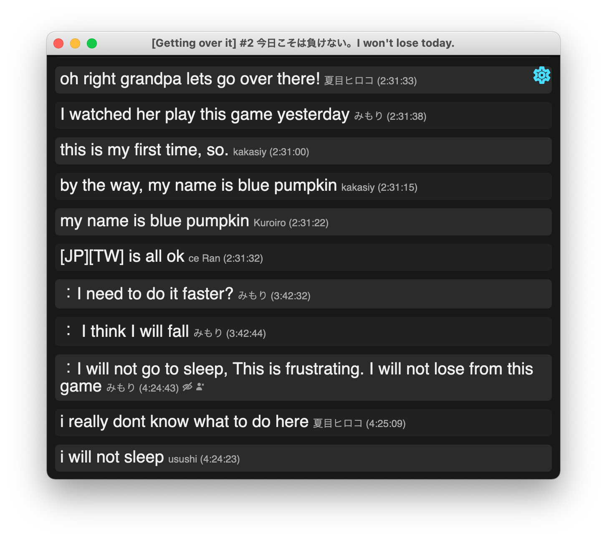

# Getting Started with LiveTL

You must have the <a href="https://kentonishi.github.io/LiveTL/">LiveTL extension</a> installed to use LiveTL features.

## Launching LiveTL

To get started, visit your favorite streamer on YouTube. The chat should have some new buttons for launching LiveTL!

Alternatively, you can open LiveTL from within HoloTools!

## Frequently Asked Questions

### How does LiveTL work?
LiveTL is, at its core, a chat filter for YouTube streams. It helps foreign viewers better catch translations that other viewers are providing in the live chat. LiveTL does not automatically translate streams -- instead, it picks up translations found in the chat.

### I installed LiveTL but I don't see any buttons. 
Once you install the extension, you must reload the YouTube stream for LiveTL to take effect.

### I don't see any translations in the translations panel.
If there are no translators in chat, LiveTL is unable to provide translations. Any messages properly tagged with a language (ex. `[en]`, `ESP:`, etc.) will appear when they are available.

### A translator is using their own style of language tags.
You can manually select additional users to filter in the settings.

### I'm a Safari user, and I can't use the chat!
You must disable the `Prevent Cross-site tracking` option in safari privacy settings.

## Other Info

If you like LiveTL, don't forget to <a href="https://kentonishi.github.io/LiveTL/" target="about:blank">share it with your friends</a>
and <a href="https://kentonishi.github.io/LiveTL/about/review">give
us a 5-star review</a>!

Please feel free to give us feedback or suggestions through the LiveTL Discord
server! [Here is the invite](https://discord.gg/uJrV3tmthg).

Our code is completely open source on GitHub. We would appreciate if you could drop a
star! [Here is our repository](https://github.com/KentoNishi/LiveTL).

## Screenshots

### LiveTL Viewer

### Options

### Pop-out Translations

