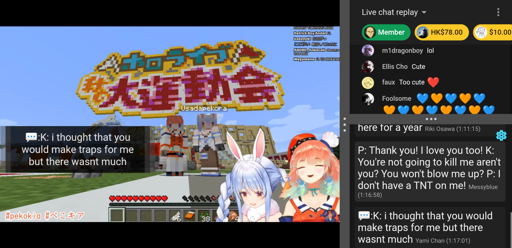

# Download LiveTL

<h3 style="width: 100%;text-align:center;">Choose your platform below!</h3>

    
    
    

<h4 style="width: 100%;text-align:center;">... or <a href="https://github.com/KentoNishi/LiveTL/releases">download the latest Android APK or ZIP manually</a>!</h4>
 

More information is available here:
* [Getting Started with LiveTL (Desktop)](https://kentonishi.github.io/LiveTL/about)
* [Getting Started with LiveTL (Android)](https://kentonishi.github.io/LiveTL/about/android)

